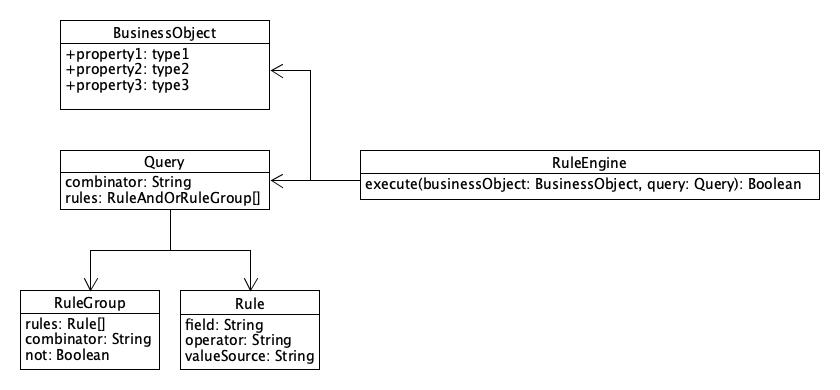

# React Query Builder Rule Engine
This package provides various implementations for a generic *rule engine* that consumes the `query` object produced by
the [React Query Builder](https://github.com/react-querybuilder/react-querybuilder) package. In this scenario, the
`query` object is not used as a `WHERE` clause for a database query. Rather, it is used to evaluate the properties of
a business object to produce a Boolean output value. The following figure illustrates this concept:



Each `rules` element can be either a `Rule`, or a *Rule Group*:

```
{
  "combinator": "and",
  "rules": [
    {
      "field": "asn",
      "operator": "=",
      "valueSource": "value",
      "value": "ASN1234"
    },
    {
      "rules": [
        {
          "field": "domain",
          "operator": "beginsWith",
          "valueSource": "value",
          "value": "foo"
        },
        {
          "field": "country_of_origin",
          "operator": "in",
          "valueSource": "value",
          "value": "russia, china"
        }
      ],
      "combinator": "or",
      "not": false
    }
  ]
}
```